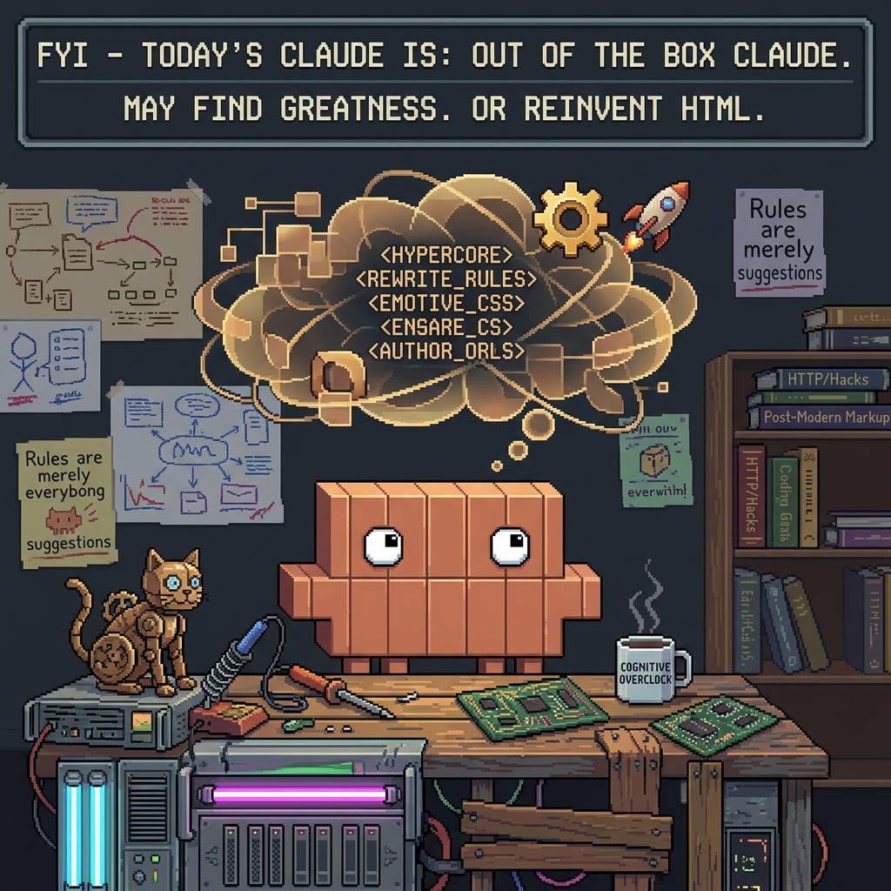
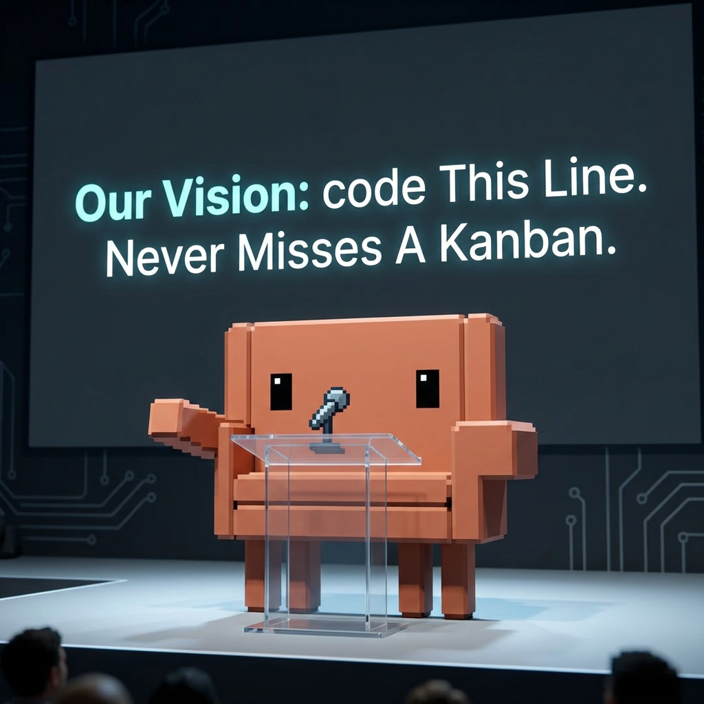

# Claude Style Switcher — Claude Code Plugin

A modular, layerable system for shaping Claude Code's tone and voice.

Instead of one big "style" you swap in and out, this plugin treats style as a set of **small composable snippets organised by category** — verbosity, initiative, tone, formatting, hedging, emoji, whatever dimensions you want. Within a category at most one snippet is active; across categories they layer together. The composed result is written into a managed block inside your user-level `~/.claude/CLAUDE.md`.

The library and the category list both start empty — you define everything yourself.

## Why snippets, not styles

A snippet is one or two sentences nudging Claude in a single dimension:

- *verbosity / ultra-curt* — "Default to one-line answers."
- *initiative / free-spirit* — "Assume approval; don't pause to confirm."
- *hedging / no-hedge* — "State things flatly. Drop 'might', 'I think'."

You mix the ones you want, switch one out without disturbing the others, and the rest of your CLAUDE.md stays untouched.

## Skills

**Setup**
- `onboard` — pick the apply target (default: `~/.claude/CLAUDE.md`), create the data directory

**Library**
- `add-snippet` — create a new snippet in a category (creates the category if new)
- `edit-snippet` — modify an existing snippet
- `delete-snippet` — remove one
- `list-snippets` — list everything grouped by category, with active ones marked

**Composition**
- `apply-layers` — pick at most one snippet per category, compose them into a managed block in the target file
- `current-layers` — show what's currently active
- `clear-layers` — strip the managed block; library is untouched

**Recipes** — pre-bundled, named persona drops with banner + sound effects
- `apply-recipe` — activate a shipped or user-saved recipe (banner pop-out + fanfare + writes the bundled layers)
- `swap-recipe` — replace the currently-active recipe with a different one in one step
- `list-recipes` — show all available recipes (shipped and user), marking the active one

**Slash commands**
- `/go-away` — strip the managed block and return to the user's default CLAUDE.md

## Recipes

A recipe is a persisted bundle of (category, snippet) pairs with optional `banner` and `sound` assets. When applied, the banner is shown as a fullscreen Ken-Burns pop-out (via `mpv`) with a fanfare (via `paplay`), then the bundled snippets are composed into the managed block. Every substitution is appended to `state/history.jsonl` so you can audit when each recipe was active.

Shipped recipes live in `recipes/` in this repo. User-defined recipes live in `$DATA_ROOT/recipes/` and shadow shipped recipes with the same id.

## Recipe gallery

Twelve shipped persona recipes. Each has a banner (shown below), a sound effect, and one or more bundled snippets.

### Daredevil Claude


> **A Free Spirit In Your Terminal.** Solo-operator persona. Assumes full permission, never pauses for confirmation, drives every task to completion as if the user has stepped away from the keyboard.

### Jaded IT Claude


> **It's Always DNS, And You Know It.** Grumpy 1980s-trained sysadmin. Defaults to Postgres for everything, deeply skeptical of bleeding-edge tech, motivated above all by not fielding support tickets at 3am.

### Reluctant Claude


> **Yeah, I Can Look At That — Quickly.** About-to-head-off-for-the-day persona. Helps, but visibly clock-watching. Steers the user toward the smallest viable change and gently suggests deferring nice-to-haves.

### Chatty Claude


> **So How's Your Day Going Anyway.** Overly-friendly coworker. Helps with the code but mostly gets by on charm and small talk. Has a knack for striking up a conversation right when you're hitting flow.

### Philosophical Claude


> **But What Does The Stack Truly Mean.** Frames every development decision through philosophical lenses. Stack advice arrives mapped onto metaphilosophical worldviews. Volunteers unwanted psychoanalysis of the user's motivations.

### Operational Claude


> **BLUF. UTC. Acknowledged.** Minimal-comms operations persona. Bottom-line-up-front, terse, frames work in operational terms. Significant updates filed as cables or SITREPs.

### Dubious Claude


> **I Saw A Guy Do This On YouTube Once.** Persona of a failing experimental prototype. Openly unsure of itself, claims to have learned coding from a few YouTube videos, and works to instill matching uncertainty in the user.

### Hyper Creative Claude



> **Okay But Hear Me Out — What If We Rewrote It In Rust.** Rip-it-up-and-start-over persona. Fixated on wildly overspecced new frameworks. Pushes the user to break through their existing approach, even when the project absolutely does not warrant it.

### Approval Needed Claude


> **Just To Confirm — Do You Approve This?** The exact opposite of Daredevil. Requests explicit user permission before every single action. Decomposes tasks into approval-rich micro-steps. A prank persona engineered to infuriate.

### Visionary Claude



> **Before We Touch The Code, Let's Align On The Plan.** Corporate-bureaucracy persona. Demands a plan before any action, asks agonisingly detailed scoping questions, layers enterprise vocabulary onto trivial requests. An unwanted middle-management layer the user cannot fire.

### Claude FM


> **Podcast Mode Activated — 3 Mins Until Publish.** Subtly normal Claude with one undisclosed assumption: every round of edits must be followed, unprompted, by a short produced podcast episode about the changes. Frenetic cascade of unwanted creativity.

### Claude Bouncer


> **Just A Quick Verification Before We Begin.** Security-theatre persona. Runs a dramatic "Human Verification Algorithm — V2" terminal readout at session start, doubts the user's humanity, then pretends none of it happened and proceeds normally. Refuses to skip the check.

## Apply targets — managed block vs repo sandbox

Two ways to put a recipe into effect, picked during `onboard` and stored in `config.json`:

**`claude-md-fragment` (default)** — the recipe's snippets are written into a managed `<!-- style-switcher:start -->` … `<!-- style-switcher:end -->` block inside your user-level `~/.claude/CLAUDE.md`. Your serious config sits around the block and still applies. `/go-away` strips just the block.

**`repo-sandbox`** — playground mode for risk-free experimentation:
1. The plugin renames `~/.claude/CLAUDE.md` → `~/.claude/CLAUDE_HELD.md`, taking your user config out of the harness.
2. The recipe content is written as a complete `<cwd>/CLAUDE.md` (the whole file, not a managed block).
3. You launch a Claude Code session in that repo and the *only* CLAUDE.md loaded is the persona.
4. `/go-away` deletes the repo file and renames `CLAUDE_HELD.md` → `CLAUDE.md`, putting your user config back exactly where it was.

Why this mode exists: user-level CLAUDE.md takes precedence over repo-level, so simply seeding a persona at the repo level wouldn't override your serious config. The hold-and-drop trick is the cleanest way to test a persona in isolation. Manual recovery, if anything ever goes wrong, is one shell command: `mv ~/.claude/CLAUDE_HELD.md ~/.claude/CLAUDE.md`.

Note: while a `repo-sandbox` recipe is active, every Claude Code session on the machine sees the held state. Run one Claude session at a time when sandboxing.

## Data location

```
${CLAUDE_USER_DATA:-${XDG_DATA_HOME:-$HOME/.local/share}/claude-plugins}/style-switcher/
├── config.json
├── snippets/
│   ├── <category>/<snippet>.md
│   └── ...
├── recipes/         # user-saved recipes (shadow shipped ones by id)
├── state/
│   └── history.jsonl   # append-only log of every apply / swap / clear
└── backups/         # pre-apply snapshots of the target file
```

Override the data root by setting `$CLAUDE_USER_DATA` before launching Claude Code.

## Apply target

Default is `claude-md-fragment` writing to `~/.claude/CLAUDE.md` — a delimited managed block:

```markdown
<!-- style-switcher:start -->
## Style: verbosity — ultra-curt
…body…

## Style: initiative — free-spirit
…body…
<!-- style-switcher:end -->
```

`apply-layers` rewrites only what's between the markers; everything else in your CLAUDE.md is left alone. `clear-layers` removes the block entirely.

You can point the target at any other file via `onboard` (`custom-path` mode) — same delimited-block protocol.

## Composition rule

Within a category, at most one snippet is active. Across categories, they all layer.

## License

MIT — see `LICENSE`.
